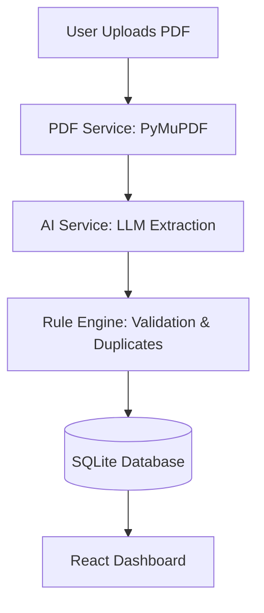

# Cashfeed AI Invoice Processor Demo

A full-stack, AI-powered e-invoicing platform demo built to showcase modern financial workflow automation. This project simulates the core extraction and validation pipeline used by startups like Cashfeed to prepare for future e-invoicing mandates.

## 🚀 Features

- **Automated Ingestion**: Seamless PDF upload and text extraction using [PyMuPDF](https://github.com/pymupdf/PyMuPDF).
- **AI-Driven Extraction**: Intelligent field extraction (Vendor, Amount, Tax, Date) using LLMs with a robust mock fallback for deterministic testing.
- **Rule-Based Validation**: Automatic status assignment based on:
  - **Duplicate Detection**: Cross-references against the SQLite database.
  - **Confidence Thresholds**: Flags low-confidence extractions for manual review.
  - **High-Value Flags**: Automated review triggers for invoices exceeding 1000 EUR.
- **Minimalist Dashboard**: A premium, sleek React frontend inspired by modern AI interfaces (Claude-style), focused on clarity and accounting efficiency.

## 🛠️ Tech Stack

### Backend
- **Python 3.10+**
- **FastAPI**: High-performance API framework.
- **SQLModel & SQLite**: Elegant ORM and lightweight database.
- **Groq/OpenAI**: AI structuring engine.

### Frontend
- **React & TypeScript**
- **Vite**: Ultra-fast build tool.
- **Framer Motion**: Smooth micro-interactions and animations.
- **Vanilla CSS**: Custom minimalist design system.

## 🏁 Getting Started

### Prerequisites
- Python 3.10+
- Node.js & npm

### Installation

1. **Clone and Install Backend Dependencies**
   ```bash
   pip install -r requirements.txt
   ```

2. **Install Frontend Dependencies**
   ```bash
   cd frontend
   npm install
   ```

### Running the Project

1. **Start the Backend Server (from root)**
   ```bash
   uvicorn app.main:app --reload
   ```

2. **Start the Frontend (from frontend directory)**
   ```bash
   npm run dev
   ```

Open [http://localhost:5173](http://localhost:5173) to view the dashboard.

## 🏗️ Architecture



